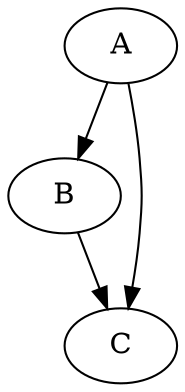

# Graphviz
> 오늘 Graphviz 라는 SW 를 접했다. 그래서 정리한다.

Graphviz(Graph Visualization Software)는 AT&T 연구소에서 개발한 그래프를 시각화하기 위한 오픈 소스 소프트웨어 도구이다. 주로 네트워크 다이어그램, 조직도, 데이터 구조, 상태 기계 등을 시각화하는 데 사용된다.

## 주요 특징
- **DOT 언어**: Graphviz는 그래프를 정의하기 위한 간단한 텍스트 기반의 DOT 언어를 사용한다.
- **다양한 레이아웃**: 다양한 그래프 레이아웃 엔진(digraph, neato, fdp, sfdp, twopi, circo)을 제공하여 그래프의 구조에 따라 최적의 레이아웃을 선택할 수 있다.
- **출력 형식**: 그래프를 PNG, PDF, SVG 등 다양한 형식으로 출력할 수 있다.
- **사용 편의성**: 간단한 명령어와 텍스트 파일로 그래프를 쉽게 정의하고 생성할 수 있다.

## DOT 언어
DOT 언어는 Graphviz에서 그래프를 정의하는 데 사용되는 간단한 텍스트 기반 언어이다. 주요 구성 요소는 다음과 같다:
- **그래프 유형**: 
  - `digraph`는 방향성 그래프를 정의한다.
  - `graph`는 무방향성 그래프를 정의한다.
- **노드**: 노드는 그래프의 개체를 나타낸다. 노드는 별도의 선언 없이 간선 정의 시 자동으로 생성된다.
  - 예: `A`, `B`, `C`
- **간선**: 노드 간의 연결을 나타낸다. 방향성 그래프에서는 `->`, 무방향성 그래프에서는 `--`를 사용한다.
  - 예: `A -> B`, `A -- B`
- **속성**: 노드와 간선에 스타일이나 레이블 등을 지정할 수 있다.
  - 예: `[color=red, label="example"]`

### 예제 코드
- 이 코드는 A에서 B로, B에서 C로, 그리고 A에서 C로 향하는 세 개의 간선이 있는 방향성 그래프를 정의한다

### DOT 언어 구성 요소
1. **그래프 정의**:
   - `digraph` 또는 `graph` 키워드로 시작한다.
   - 중괄호 `{}`로 그래프의 범위를 정의한다.
   ```dot
   digraph G {
       // 그래프 내용
   }
   ```
2. **노드 정의**:
   - 노드는 간선 정의 시 자동으로 생성되며, 별도로 선언할 수도 있다.
   - 속성을 사용하여 노드의 스타일을 지정할 수 있다.

``` dot
A [shape=circle, color=blue];
B [label="Node B"];
```
3. **간선 정의**:
   - 노드 간의 연결을 정의한다.
   - 속성을 사용하여 간선의 스타일을 지정할 수 있다.

``` dot
A -> B [color=red, label="A to B"];
B -> C;
A -- C [style=dotted];
```
4. **속성 지정**:
   - 그래프, 노드, 간선 각각에 속성을 지정할 수 있다.
   - 그래프 전역 속성도 설정 가능하다.

``` dot
digraph G {
    node [shape=box];  // 모든 노드의 기본 모양을 박스로 설정
    edge [color=gray]; // 모든 간선의 기본 색상을 회색으로 설정

    A -> B;
    B -> C [color=red]; // 특정 간선에 대해 별도로 속성 설정
    A -> C [style=dashed];
}
;
```
